# 🛡️ Cyber-Trace: Security Log Analysis Pipeline


**Cyber-Trace** is a production-grade ETL pipeline designed to ingest, process, and analyze cybersecurity logs (Mordor Dataset) using the **Medallion Architecture**. It processes raw JSON logs into actionable threat insights while strictly adhering to **GDPR/Privacy** standards through PII masking.

> **🔄 Project Context:** Originally prototyped on AWS S3, this project has been fully migrated and re-engineered on **Azure Databricks** to leverage Delta Lake, Auto Loader, and Unity Catalog integration.

## 🎯 Key Features & Business Value

### 1. Threat Detection Dashboard
Visualizes attack patterns (Attacker IP vs. Victim Host) to support Security Operations Centers (SOC).

*Fig 1. Analytics Dashboard showing attack volume. Note the PII Masking (XXX) applied to the Attacker IP column to protect identity.*

### 2. Privacy by Design (GDPR/RODO)
* **PII Masking:** Implemented a custom `mask_ip()` transformation in the Silver layer.
* **Logic:** Replaces the last octet of IP addresses with `XXX` (e.g., `172.18.39.XXX`) before data reaches the analytical layer.
* **Access Control:** Raw logs (Bronze) are restricted; Analysts work only on masked data (Silver/Gold).

### 3. Production-Grade Engineering
* **Structured Logging:** Centralized logging module provides clear observability into pipeline health and schema enforcement.

*Fig 2. System logs confirming PII Masking active and Time-Series Partitioning initialization (`partitionBy event_date`).*

* **Automated Testing:** CI/CD pipeline runs `pytest` and linters on every commit to ensure code quality.


---

## 🏗️ Architecture (V2)

The pipeline follows a **V2 Blue-Green** deployment strategy to handle schema evolution.

```mermaid
graph LR
    Raw[("📄 Raw Logs<br>(JSON/AutoLoader)")] -->|Ingest| Bronze[("🥉 Bronze V2<br>(Delta Lake)")]
    Bronze -->|Clean & Mask PII| Silver[("🥈 Silver V2<br>(Partitioned Delta)")]
    Silver -->|Aggregate| Gold[("🥇 Gold V2<br>(Threat Stats)")]
    
    %% Styles for better visibility on light/dark mode
    style Bronze fill:#A0522D,stroke:#333,stroke-width:2px,color:#fff
    style Silver fill:#708090,stroke:#333,stroke-width:2px,color:#fff
    style Gold fill:#FFD700,stroke:#333,stroke-width:2px,color:#000
```



* **Tech Stack:** Azure Data Lake Gen2, Databricks (PySpark), GitHub Actions, Delta Lake.

## 🚀 Engineering Highlights

* **OCSF Alignment:** Refactored schema to align with Open Cybersecurity Schema Framework standards (mapped `SourceIp` → `src_ip`, `SourceImage` → `process_path`).
* **Performance:** Silver tables are partitioned by `event_date` to enable **Partition Pruning**, significantly reducing query costs for historical analysis.
* **FinOps:** Uses `Trigger.AvailableNow` to process data in micro-batches, saving ~90% of compute costs compared to 24/7 streaming.
* **Defensive Coding:** Custom `secure_nested()` logic handles Schema Drift in complex JSONs without crashing the stream.

## 📂 Project Structure
```text
├── src/
│   ├── transformations.py  # Core Logic: PII Masking, OCSF Mapping
│   ├── logger.py           # Structured Logging Module
│   └── config.py           # Configuration & Path Management
├── tests/                  # Unit Tests (Pytest)
├── notebooks/              # Databricks Notebooks (01_Ingest, 02_Silver, 03_Gold)
└── docs/
    ├── adr/                # Architecture Decision Records
    └── images/             # Documentation screenshots
```

## 🛠️ How to Run

1.  **Prerequisites:** Azure Subscription (ADLS Gen2, Key Vault) & Databricks Workspace.
2.  **Setup:**
    * Clone the repo.
    * Configure secrets in Azure Key Vault.
3.  **Execution:**
    * Run `notebooks/01_ingest_mordor_logs` (Ingest Raw -> Bronze V2).
    * Run `notebooks/02_silver_transformations` (Bronze -> Silver V2 with Masking).
    * Run `notebooks/03_gold_business_analytics` (Silver -> Gold Dashboard).

---
*Author: Jakub Milczarczyk*